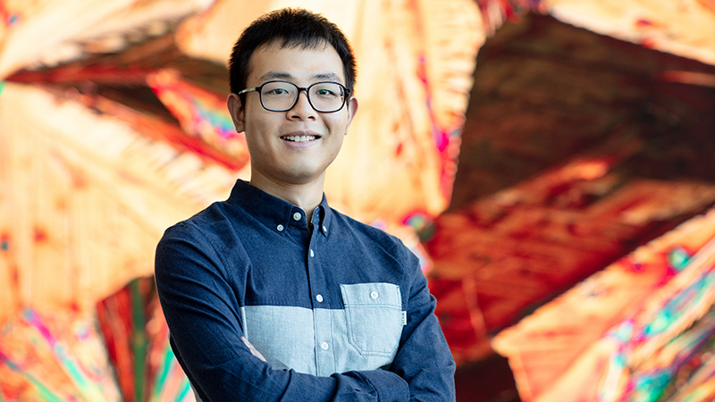
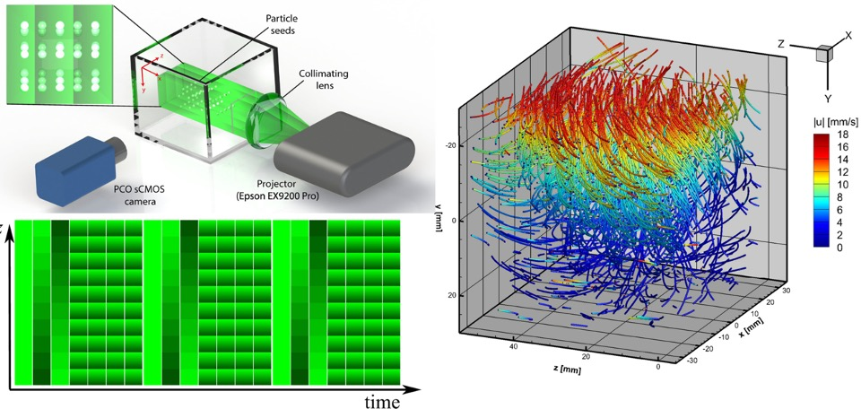
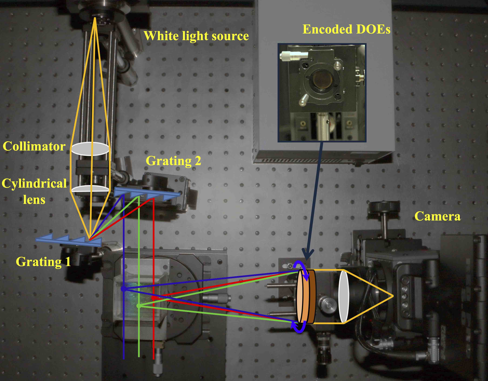
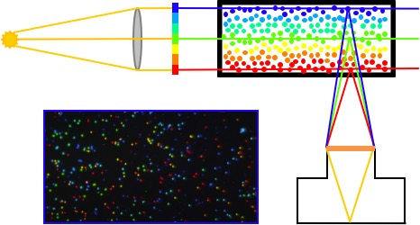

<html><head>
<meta name="keywords" content="Jinhui Xiong, CS, KAUST"> 
<meta name="description" content="Jinhui's home page">
<link rel="stylesheet" href="https://congliwang.github.io/assets/css/style.css">
<title>Jinhui Xiong - Homepage</title>
</head>
  
<body>
<table id="personalInfo" width="100%">
	<tr>
		<td width="500">
		<h1>Jinhui Xiong</h1>
		</td>
		<td rowspan="3" align="center">
		
		</td>
	</tr>
 
 
	<tr>
		<td>	
        <h3>CS PHD student, KAUST</h3>		
 
		Email: jinhui.xiong@kaust.edu.sa
		</td>
	</tr>
</table>
  

<h3>Research Interests:</h3>

Computational Imaging, 3D Reconstruction, Optical Flow, Representation Learning, Numerical Optimization  
  
 

<h3>Bio:</h3>

Jinhui Xiong is a fourth-year Computer Science PhD student at Visual Computing Center, King Abdullah University of Science and Technology  (KAUST), working with Professor <a href="https://vccimaging.org/People/heidriw/">Wolfgang Heidrich</a>. He is a member of Computational Imaging Group. His work is specilized on computational fluid imaging, which is a highly interdisciplinary research field combining methods from optimization, computer vision, optics, computer graphics. He is also interested in studying novel imaging methodologies that can be utilized for 3D scene reconstruction or related research topics.

Jinhui will do a research intern at the Computational Imaging Lab at Snap Research (New York City). 

<h3>Education:</h3>
<ul>
  <li>2017 - Now: Ph.D. in Computer Science, KAUST</li>
  <li>2015 - 2016: M. Sc in Computer Science, KAUST</li>
  <li>2011 - 2015: B. Eng in Electrical Engineering, City University of Hong Kong</li>
</ul>

<h3>Publications: </h3>

<a href="https://scholar.google.com/citations?user=G2aQMDEAAAAJ&hl=en">Google Scholar</a>

<table id="Publications" width="100%">

<tr>
<td width="150"> 		</td>		
  <td>A. A. Aguirre-Pablo, A. B. Aljedaani, <b>J. Xiong</b>, R. Idoughi, W. Heidrich, S. T. Thoroddsen, &quot;Single-camera 3D PTV using particle intensities and structured light&quot;, Experiments in Fluids, 2019.

[<a href="https://vccimaging.org/Publications/Aguire-Pablo2019SingleCameraPTV/">Project Page</a>]
 	
</td>	
</tr>	

<tr>
<td width="150"> 		</td>		
  <td>Z. Xu, P. Fang, B. Xu, Y. Lu, <b>J. Xiong</b>, F. Gao, X. Wang, J. Fan, P. Shi, &quot;High-throughput three-dimensional chemotactic assays reveal steepness-dependent complexity in neuronal sensation to molecular gradients&quot;, Nature communications, 2019.
</td>	
</tr>	

<tr>
<td width="150"> 		</td>		
  <td><b>J. Xiong</b>, Q. Fu, R. Idoughi, W. Heidrich, &quot;Reconfigurable Rainbow PIV for 3D Flow Measurement&quot;, IEEE International Conference on Computational Photography (ICCP), 2018.

[<a href="https://vccimaging.org/Publications/Xiong2017RainbowPIV/">Project Page</a>]
 	
</td>	
</tr>	

<tr>
<td width="150"> 		</td>		
  <td><b>J. Xiong</b>, R. Idoughi, A. Aguirre-Pablo, A. Aljedaani, X. Dun, Q. Fu, S. T. Thoroddsen, W. Heidrich, &quot;Rainbow Particle Imaging Velocimetry for Dense 3D Fluid Velocity Imaging&quot;, ACM Transactions on Graphics (Proc. SIGGRAPH), 2017.

[<a href="https://vccimaging.org/Publications/Xiong2017RainbowPIV/">Project Page</a>]
 	
</td>	
</tr>	
</table>

<h3>Patents:</h3>
<table id="Patents" width="100%">
<tr>		
<td>
Wolfgang Heidrich, <b>Jinhui Xiong</b>, Xiong Dun, Ramzi Idoughi, Sigurdur Tryggvi Thoroddsen,
Andres A Aguirre-Pablo, Abdulrahman B Aljedaani, Erqiang Li, “Rainbow Particle Imaging
Velocimetry for Dense 3D Fluid Velocity Imaging,” Aug 2018, U.S. Patent 15,498,317.
</td>	
</tr>	
</table>

</body>

</html>
