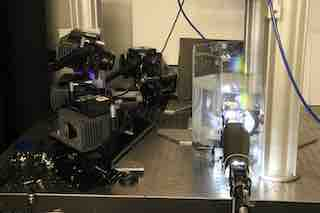
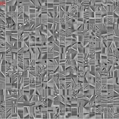

<html>
<head>
<meta name="google-site-verification" content="eRLyhcIU4ZeZsNViH5cCXgT2RHidH8AyWTDs8SSG-po" />
<!-- Global site tag (gtag.js) - Google Analytics -->

<!-- meta name="description" content="Jinhui Xiong's home page" -->
<link rel="stylesheet" href="assets/css/style.css">
<meta name="google-site-verification" content="eRLyhcIU4ZeZsNViH5cCXgT2RHidH8AyWTDs8SSG-po" />
<title>Jinhui Xiong - Homepage</title>
</head>
  
<body>
<table id="personalInfo" width="100%">
	<tr>
		<td width="500">
		<h1>Jinhui Xiong</h1>
		</td>
		<td rowspan="3" align="center">
		
		</td>
	</tr>
 
 
	<tr>
		<td>	
        <h3>CS PHD student, KAUST</h3>		
 
		Email: jinhui.xiong@kaust.edu.sa
		</td>
	</tr>
</table>
  

<h3>Research Interests</h3>

Computational Imaging, 3D Reconstruction, Optical Flow, Numerical Optimization, Low-Light Imaging
  
 

<h3>Biography</h3>

Jinhui Xiong is a final-year Computer Science PhD student at Visual Computing Center, King Abdullah University of Science and Technology  (KAUST), working with Professor <a href="https://vccimaging.org/People/heidriw/">Wolfgang Heidrich</a>. My work is at the intersection of computational imaging, computer vision, computer graphics, optimization. My research goal is to design novel imaging methodologies that can be utilized for 3D scene reconstruction or related research topics.

I was fortunate to be a research intern at the Computational Imaging Lab at Snap Research (New York City) working with Jian Wang and Shree Nayar. 

<b>I am currently on the job market. Reach out if you are interested in my research background.</b>

<h3>Education</h3>
<ul>
  <li>2017 - Now: Ph.D. in Computer Science, KAUST</li>
  <li>2015 - 2016: M. Sc in Computer Science, KAUST</li>
  <li>2011 - 2015: B. Eng in Electrical Engineering, City University of Hong Kong</li>
</ul>

<h3>Publications</h3>

<a href="https://scholar.google.com/citations?user=G2aQMDEAAAAJ&hl=en">Google Scholar</a>

<table id="Publications" width="100%">

<tr>
<td> 		</td>		
<td style="padding:20px;width:75%;vertical-align:middle">

<b>Seeing in Extra Darkness Using a Deep-Red Flash</b> 
<b>J. Xiong</b>, J. Wang, W. Heidrich, S. Nayar 
CVPR 2021 (Oral)

Project Page [coming soon]
 	
</td>	
</tr>

<tr>
<td> 		</td>	
<td style="padding:20px;width:75%;vertical-align:middle">

<b>RainbowPIV with improved depth resolution –   design and comparative study with TomoPIV</b> 
<b>J. Xiong</b>, A. Aguirre-Pablo, R. Idoughi, S. Thoroddsen, W. Heidrich 
Measurement Science and Technology 2020

[<a href="https://vccimaging.org/Publications/Xiong2020SuperDepthRainbowPIV/">Project Page</a>]
 	
</td>	
</tr>

<tr>
<td> 		</td>	
<td style="padding:20px;width:75%;vertical-align:middle">

<b>Stochastic Convolutional Sparse Coding</b> 
<b>J. Xiong</b>, P. Richtarik, W. Heidrich 
The International Symposium on Vision, Modeling and Visualization, 2019. (Best Paper Award)

[<a href="https://vccimaging.org/Publications/Xiong2019StochasticCSC/">Project Page</a>]
 	
</td>	
</tr>	

<tr>
<td> 		</td>	
<td style="padding:20px;width:75%;vertical-align:middle">

<b>Single-camera 3D PTV using particle intensities and structured light</b> 
A. A. Aguirre-Pablo, A. B. Aljedaani, <b>J. Xiong</b>, R. Idoughi, W. Heidrich, S. T. Thoroddsen 
Experiments in Fluids 2019

[<a href="https://vccimaging.org/Publications/Aguire-Pablo2019SingleCameraPTV/">Project Page</a>]
 	
</td>	
</tr>	

<tr>
<td> 		</td>	
<td style="padding:20px;width:75%;vertical-align:middle">

<b>High-throughput three-dimensional chemotactic assays reveal steepness-dependent complexity in neuronal sensation to molecular gradients</b> 
Z. Xu, P. Fang, B. Xu, Y. Lu, <b>J. Xiong</b>, F. Gao, X. Wang, J. Fan, P. Shi 
Nature communications 2019

</td>	
</tr>

<tr>
<td> 		</td>	
<td style="padding:20px;width:75%;vertical-align:middle">

<b>Reconfigurable Rainbow PIV for 3D Flow Measurement</b> 
<b>J. Xiong</b>, Q. Fu, R. Idoughi, W. Heidrich 
IEEE International Conference on Computational Photography (ICCP) 2018
	

[<a href="https://vccimaging.org/Publications/Xiong2017RainbowPIV/">Project Page</a>]
 	
</td>	
</tr>	

<tr>
<td> 		</td>	
<td style="padding:20px;width:75%;vertical-align:middle">

<b>Rainbow Particle Imaging Velocimetry for Dense 3D Fluid Velocity Imaging</b> 
<b>J. Xiong</b>, R. Idoughi, A. Aguirre-Pablo, A. Aljedaani, X. Dun, Q. Fu, S. T. Thoroddsen, W. Heidrich 
ACM Transactions on Graphics (Proc. SIGGRAPH) 2017
	

[<a href="https://vccimaging.org/Publications/Xiong2017RainbowPIV/">Project Page</a>]
 	
</td>	
</tr>	
</table>

<h3>Patents</h3>
<table id="Patents" width="100%">
<tr>		
<td>
Wolfgang Heidrich, <b>Jinhui Xiong</b>, Xiong Dun, Ramzi Idoughi, Sigurdur Tryggvi Thoroddsen,
Andres A Aguirre-Pablo, Abdulrahman B Aljedaani, Erqiang Li, “Rainbow Particle Imaging
Velocimetry for Dense 3D Fluid Velocity Imaging,” Aug 2018, U.S. Patent 15,498,317.
</td>	
</tr>	
</table>

</body>

</html>
